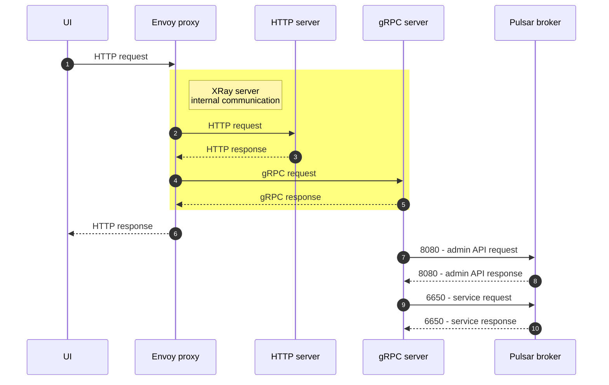

# Architecture

## High-level overview

- GitHub for source code hosting, project management and CI.
- Nix for managing development environment.
- React + TypeScript for UI.
- Scala 3 for the server.
- Protobuf and gRPC-Web for communication between UI and server.

  In order to transform HTTP requests to Protobuf and vice-versa, we use Envoy proxy. Maybe [someday](https://github.com/grpc/grpc-java/issues?q=is%3Aissue+%22grpc-web%22) we'll can get rid of it.

- AWS EKS Kubernetes clusters for test Pulsar deployments.
- AWS EC2 instances for manual testing on Windows, Linux and MacOS.

## API Communication

## Security checklist

- [ ] Envoy <-> User Browser :: TLS
- [ ] GrpcServer <-> Envoy :: mutual TLS
- [ ] HttpServer <-> Envoy :: mutual TLS
- [ ] Embedded Postgres <-> Dekaf Server :: Postgres SSL authentication
- [ ] Pulsar <-> Dekaf Server :: Pulsar TLS authentication
