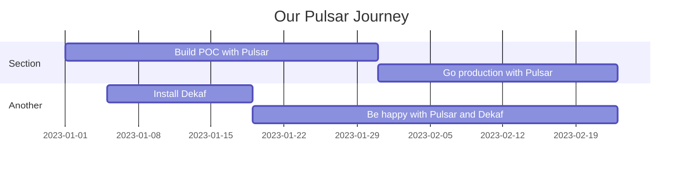

### Replace with your Markdown

Markdown is a user-friendly 🙂 markup language that allows to:

- Create lists
- **format** *text*
- [insert links](https://dekaf.io)
- Insert charts using [Mermaid.js](https://mermaid.js.org/ ):

- Insert tables:

|       | Column A | Column B | Column C | Column D |
|-------|----------|----------|----------|----------|
| Row A | A A      | B A      | C A      | D A      |
| Row B | A B      | B B      | C B      | D B      |
| Row C | A C      | B C      | C C      | D C      |

- ...etc.

📘 [Markdown language reference](https://github.github.com/gfm/)

> We don't support uploading images yet, but you can refer external image by it's URL.
